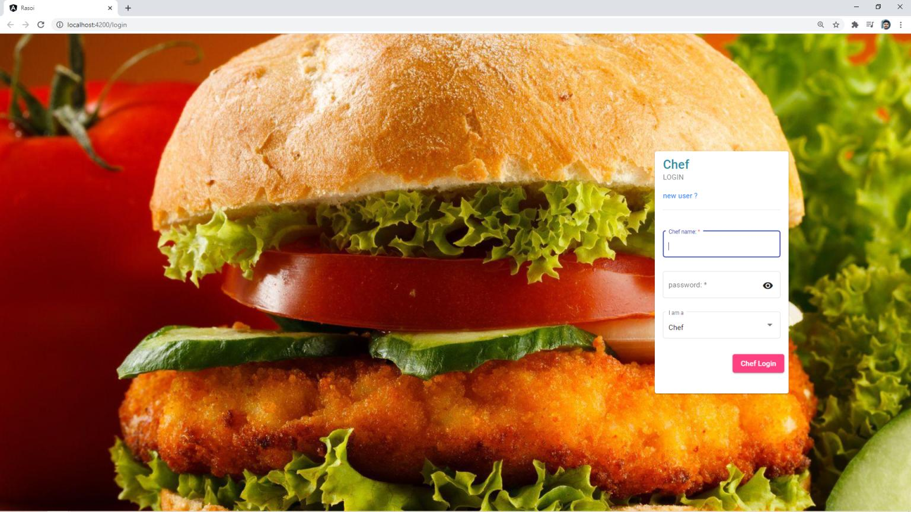

Thank You for showing interest in the App :)
********************************************

Rasoi is made mainly on Angular and is a demo Food Ordering App

Here Chef can sell food
& Customer can buy food
There is also Drone Management Service (DMS) component to track and manage Drones which are used for Delivery of Food Items 
open this URL in your browser after running the app to use DMS.

## Screen-Shots

**Welcome**       |  **Login**
:-------------------------:|:-------------------------:
|
**Create World**         |  **Join World**
|
**View World**          |  **Chat** 
|
**Add Members**         |  **View Members** 
|
**Settings** | **About App**
|


Note: I would recommend using Chrome Browser
>>localhost:4200/dms


# Rasoi
TO run the app 
>>ng serve -o

You must run a database Server with the app
Here you can use any one of the following

Note: I would recommend using 1st method (JSON Server) 

1.npm JSON Server
to create database
>>npm run generate 
to run JSON server and host the database created above
>>npm run server

---------------------------------------     OR     --------------------------------------------------------------

2.MySql database using SpringBoot Api
You should have mySql installed on you system and database should be created and populated
Then open the SpringBoot Directory in SpringBoot tool and run the app
Here you have to make changes to you "http.service.ts" file present in "src\app\services\http.service.ts" directory

Replace the code there with the one given below!!

http.service.ts
==============================================================

```bash
import { Injectable } from '@angular/core';
import { HttpClient } from "@angular/common/http";
import { OrdersComponent } from '../components/home/customer/orders/orders.component';

@Injectable({
  providedIn: 'root'
})
export class HttpService {
  
  private SERVER_URL = "http://localhost:3000/";

  constructor(private http:HttpClient) { }

  // fetches a chef using a chef's name
  async getChef(name:string){
    return await new Promise<any>((resolve, reject) => {
      this.http.get(this.SERVER_URL+'chef/name/'+name).subscribe((chefReceived:any)=>{
         resolve(chefReceived[0]);
        });
    })
  }
  async editChef(id:number,chef:any){
   this.http.put(this.SERVER_URL+'chef/'+id,chef).subscribe();
  }

  //fetches cusotomer using customer name
  async getCustomer(name:string){
    return await new Promise<any>((resolve, reject) => {
      this.http.get(this.SERVER_URL+'customer/name/'+name).subscribe((customerReceived:any)=>{
         resolve(customerReceived[0]);
        });
    })
  }
  // edit cusotmer in DB
  async editCustomer(id:number,customer:any){
   this.http.put(this.SERVER_URL+'customer/'+id,customer).subscribe();
  }
  async addChef(newChef:any){
    console.log('new chef added to DB');
    
    this.http.post(this.SERVER_URL+'chef',newChef).subscribe();
  }
  async addCustomer(newCustomer:any){
    this.http.post(this.SERVER_URL+'customer',newCustomer).subscribe();
  }
  // retruns chef menu for a particular chef with his chef id
  //used in chef product list component
  async getChefMenu(Chefid:number){
    return await new Promise<any>((resolve, reject) => {
      this.http.get(this.SERVER_URL+'food/chefID/'+Chefid).subscribe((customerReceived:any)=>{
         resolve(customerReceived);
        });
    })
  }

  //used to delete chef menu item inside chef component
   dltItem(itemIndex:number){  this.http.delete(this.SERVER_URL+'food/'+itemIndex).subscribe();  }

  //used to add chef menu item inside chef component
  addItem(newdish:any){ console.log('tryung to add');
    this.http.post(this.SERVER_URL+'food',newdish).subscribe();  }
  editItem(id:number,item:any){ this.http.put(this.SERVER_URL+'food/'+id,item).subscribe(); }  


  getAllChef(){
    return this.http.get(this.SERVER_URL+'chef');
  }

  getChefsMenu(chefid: number){
    return this.http.get(this.SERVER_URL+"food/chefID/"+chefid)
  }
  getChefsOrders(chefName:string){
    
    
    return this.http.get(this.SERVER_URL+'orders/chefName/'+chefName)
  }
 

//used to create orders
createOrder(newOrder: any){
  return this.http.post(this.SERVER_URL +'orders',newOrder);
}

//used to get oreders
getAllOrders(customerID: number){
  return this.http.get(this.SERVER_URL+'orders' +"/customerID/"+customerID);
}

dispatchitem(order:any){
  this.http.put(this.SERVER_URL+'orders/'+order.id,order).subscribe();
}
//fetches all the drones object from db to dms component
getAllDrones(){
  return this.http.get(this.SERVER_URL+'drones')
}
deleteDrone(id:number){
  this.http.delete(this.SERVER_URL+'drones/'+id).subscribe();
}
addDrone(newDrone:any){
  this.http.post(this.SERVER_URL+'drones',newDrone).subscribe();
}

//getting drones whooose busy is false
getAvailableDrones(){
 return this.http.get(this.SERVER_URL+'drones/busy/false');
}
//edit drones
editDrone(id:number,drone:any){ this.http.put(this.SERVER_URL+'drones/'+id,drone).subscribe();}

//deleting order DB
deleteOrder(id:number){
  this.http.delete(this.SERVER_URL+'orders/'+id).subscribe();
}
getDroneFromCustomerId(id:number){
   return this.http.get(this.SERVER_URL+'drones/orderID/'+id);
}


}
```
**************************************************************************


